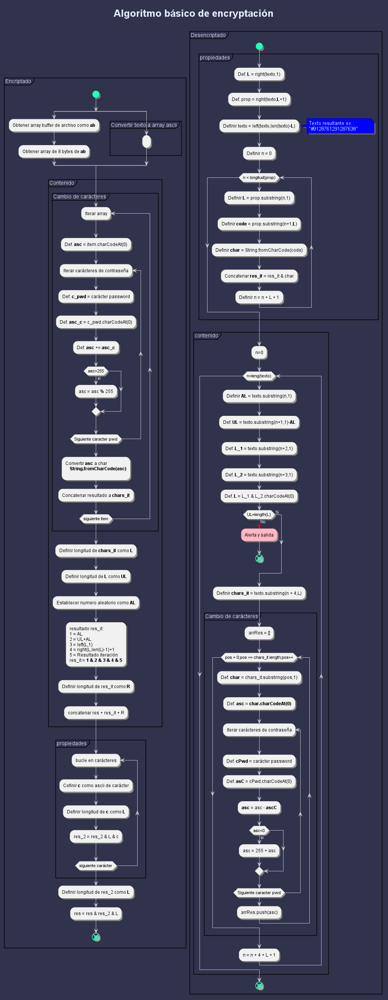

# Proyecto encriptador

- La página debe tener campos para inserción del texto que será encriptado o desencriptado, y el usuario debe poder escoger entre as dos opciones.
- El resultado debe ser mostrado en la pantalla.
- Un botón que copie el texto encriptado/desencriptado para la sección de transferencia, o sea que tenga la misma funcionalidad del ctrl+C o de la opción "copiar" del menú de las aplicaciones.

## Elementos principales de la página
1. Título de su sitio web
1. Campo para el texto que va a ser encriptado/desencriptado
1. Un botón para encriptar
1. Un botón para desencriptar
1. Área para mostrar el texto encriptado/desencriptado.

## Extra!
1. Un rodapie con los datos de la persona que desarrolló el sitio web!

## Extrapersonal
- Encriptar archivos
    - Planear UX/UI
        - Drag over para permitir arrastrar el archivo
        - Al momento de arrastrar un archivo se visualice la interface de como se visualiza
    - Investigar Algoritmos para encriptación de archivos
    - Agregar opción para visualizar un modal al cual se acceda mediante un button help para explicar el proceso de desarrollo de la función extra y agregando cita de las fuentes.

### Proceso de encriptación
1. Cargar archivo
1. Leer archivo
1. Convertir a arraybuffer
1. Convertir a unit8array
1. Aplicar conversión de array
1. Convertir nuevo array a archivo
1. Descargar archivo

### Algoritmo de encriptación personal

## Pendientes

|Fecha|Estatus|Actividad|
|-----|-------|---------|
|09/05|Pendiente|Generar código para códificado Alura|
|09/05|Pendiente|Generar código para decódificado Alura|
|09/05|Pendiente|Añadir funcionalidad de códificado personal|
|09/05|Pendiente|Añadir funcionalidad de decódificado personal|
|09/05|Pendiente|Mostrar resultados en div|
|09/05|Pendiente|Añadir elemento para arrastrar archivo|
|09/05|Pendiente|Generar archivo resultante y realizar pruebas|
|09/05|Pendiente|Generar biñetas de conversación de encriptado personal|
|09/05|Pendiente|Añadir funcionalidad de selección de biñetas|
|09/05|Pendiente|Añadir área para selección de tipo de códificado|

## Encryptado personal

### Seguridad
De forma temporal, esta clase establece una contraseña predeterminada oculta, esto brinda la oportunidad de  agregarse funcionalidad de establecer contraseña por el usuario, sin embargo de momento no se ha añadido esto debido a la complegidad y poco tiempo para completar el reto. sin embargo, se plantea lo siguientes requerimientos al respecto:

1. Algoritmo para recuperación de contraseña:
    Podría ingresarse la misma contraseña códificada y separada de forma aleatoria mediante metodos de convinado de arrays. la cual mediante una pregunta de seguridad ejecute la iteración para obtener la información.
2. Métodos de recoperación alternos.
    - HelpDesk para ejecutar super usuario de recuperación.
    - Contraseña master de usuario para recuperación de archivos.

